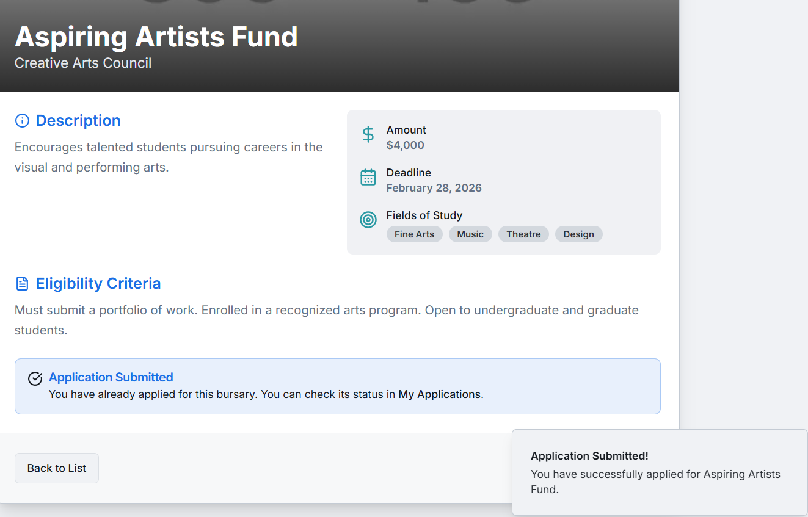

# Bursary Buddy - AI-Powered Bursary Matching

Bursary Buddy is a Next.js web application designed to simplify the process of finding and applying for bursaries. It leverages AI to match student profiles with suitable financial aid opportunities, helping students achieve their educational goals.

## Overview

Finding the right bursary can be a daunting task. Bursary Buddy aims to streamline this by providing a centralized platform where students can:
- Create and manage their academic and personal profile.
- Discover a curated list of bursaries.
- Receive AI-driven recommendations tailored to their profile.
- Track the status of their applications.

## Key Features

- **Personalized Dashboard:** A central hub displaying profile completeness, AI-recommended bursaries, application statuses, and upcoming deadlines.
- **Student Profile Management:** Users can input and update their personal details, academic records, financial situation, extracurricular activities, and career goals.
- **Bursary Discovery:** A comprehensive list of bursaries with detailed information, search, and filtering capabilities.
- **AI-Powered Matching:** Utilizes Genkit to analyze student profiles against available bursaries and recommend the most relevant opportunities.
- **Application Tracking:** Allows students to "apply" for bursaries (mocked) and track their application status (e.g., Applied, Pending, Approved, Rejected).
- **Responsive Design:** User-friendly interface accessible on various devices.
- **Modern Tech Stack:** Built with Next.js, React, ShadCN UI, Tailwind CSS, and Genkit for AI functionalities.

## How It Works

1.  **Profile Creation:** The student first creates or updates their profile with relevant academic, financial, and personal information. This information is crucial for the AI matching process.
2.  **Bursary Exploration:** Students can browse a list of available bursaries, filter them by criteria like field of study, and sort them by deadline or amount.
3.  **AI Matching:** On the dashboard, the student can trigger the AI matching feature. The system sends the student's profile information and the list of all available bursaries to a Genkit flow. The AI model then processes this data and returns a list of recommended bursaries that best fit the student's profile.
4.  **Application:** Students can view details of any bursary and "apply" for it. This action is recorded, and the application status can be tracked.
5.  **Dashboard Updates:** The dashboard reflects the student's progress, showing recommended bursaries, application statuses, and important deadlines.

## Demo Steps

Follow these steps to explore the features of Bursary Buddy:

1.  **Landing Page:**
    - When you first visit the application, you'll see the landing page.
    - Click on "Get Started Free" or "Sign In" (both lead to the dashboard for this demo).
    - 

2.  **Dashboard Overview:**
    - You are now on the main dashboard.
    - Notice sections for Profile Completeness, AI Recommended Bursaries (initially empty or prompting to find matches), My Application Status, and Upcoming Deadlines.
    -

3.  **Update Your Profile:**
    - Navigate to "My Profile" from the sidebar.
    - The form will be pre-filled with mock data. Feel free to modify any details like "Field of Study", "Academic Record Summary", "Financial Situation", etc., as these will be used by the AI.
    - Click "Save Changes". A toast notification will confirm the update.
    - 

4.  **Discover Bursaries:**
    - Go to "Discover Bursaries" from the sidebar.
    - You'll see a list of mock bursaries.
    - Try searching for a bursary by keyword (e.g., "Tech").
    - Try filtering by "Field of Study" (e.g., "Computer Science").
    - Try sorting by "Deadline" or "Amount".
    - 

5.  **View Bursary Details:**
    - Click on any bursary card (e.g., "Tech Innovators Scholarship") to see its details.
    - Review the information like description, amount, deadline, eligibility criteria.
    - 

6.  **Apply for a Bursary:**
    - On the Bursary Detail page, click the "Apply Now" button.
    - A toast notification will confirm your mock application. The button will now show "Applied".
    - Note: If the deadline has passed, the "Apply Now" button will be disabled.
    - 

7.  **Check Application Status:**
    - Navigate to "My Applications" from the sidebar.
    - You should see the bursary you just applied for listed with its status as "Applied".
    -

8.  **Get AI Recommendations:**
    - Go back to the "Dashboard".
    - In the "AI Recommended Bursaries" section, click the "Find My Matches" button.
    - The AI will process your profile (from Step 3) and the available bursaries.
    - After a few moments, recommended bursaries will appear in this section. These are bursaries the AI deems a good fit for your profile.
    - 

9.  **Explore Further:**
    - Check the "Upcoming Deadlines" on the dashboard.
    - Apply for more bursaries and see them appear in "My Applications".
    - Modify your profile again and re-run the AI matching to see if recommendations change.

This walkthrough covers the main functionalities of Bursary Buddy. Enjoy exploring!
